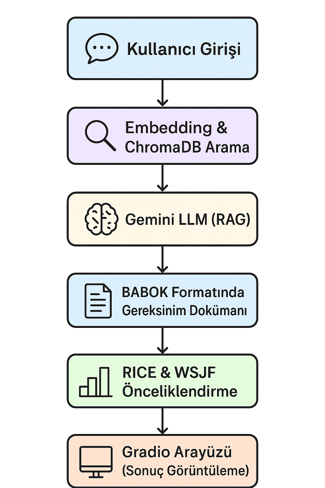

# 🤖  Business Requirement Chatbot (BABOK + RAG + Gemini)

Bu proje, iş analizi sürecinde gereksinimlerin tanımlanması, sınıflandırılması ve önceliklendirilmesini otomatikleştirmek için geliştirilmiştir.
 Geleneksel olarak saatler süren gereksinim dokümantasyonu artık birkaç saniye içinde otomatik üretilmektedir.

Sistem:

-  Veri temelli (RAG destekli),
- Uluslararası standartlara uygun (BABOK),
- Ölçeklenebilir (ChromaDB + Gemini),
- Ve kullanıcı dostu (Gradio arayüzü) bir çözümdür.

Yapay zekâ ve veri tabanı tekniklerini bir araya getirerek, kullanıcıdan alınan proje açıklamasına göre:

- Gereksinimin Functional (işlevsel) mi yoksa Non-Functional (işlevsel olmayan) mı olduğunu tahmin eder,
- BABOK (Business Analysis Body of Knowledge) standartlarına göre gereksinim dokümanı üretir
- Gereksinimlerin önemini RICE ve WSJF gibi metriklerle önceliklendirir
- Kullanıcıya kolay ve interaktif bir arayüz sunar.
Kısaca bu chatbot, bir iş analistinin yaptığı “gereksinim çıkarımı, analizi ve dokümantasyon” sürecini kısmen otomatikleştirir.

---

## 🏗️ Mimarî Genel Bakış

Sistemin genel akışı aşağıdaki diyagramda gösterilmektedir:

&gt; 💡 Not: `docs/architecture.png` görselini kendi deposuna yükleyip yolu doğru ayarlaman yeterlidir.  
&gt; Diyagram akışı: **Kullanıcı → Embedding &amp; ChromaDB → Gemini LLM (RAG) → BABOK Formatı → Önceliklendirme → Gradio Arayüzü**

---

## ⚙️ Kullanılan Teknolojiler

| Katman | Teknoloji |
|--------|------------|
| 🤖 LLM | Google Gemini 1.5 Flash / Pro |
| 🔡 Embedding | text-embedding-004 |
| 🧠 Vektör Veritabanı | ChromaDB |
| 🧰 Framework | Python 3.10+, pandas, gradio, dotenv |
| 📊 Önceliklendirme | RICE &amp; WSJF modelleri |
| 📘 Bilgi Kaynağı | PURE Annotate Dataset (Kaggle) |

---

## 🚀 Kurulum ve Çalıştırma

### 1️⃣ Gerekli Paketleri Yükle
pip install -q "chromadb&gt;=0.5.0" "google-generativeai&gt;=0.7.2" "python-dotenv&gt;=1.0.1" "gradio&gt;=4.41.0"
</code></pre>
<h3>2️⃣ API Anahtarını Ayarla</h3>

<code inline="">.env</code> dosyanı oluştur ve içine aşağıdakini ekle:

<pre><code class="language-bash">GOOGLE_API_KEY="senin_api_anahtarın"
</code></pre>
<h3>3️⃣ Uygulamayı Çalıştır</h3>
<pre><code class="language-bash">python app.py
</code></pre>

Tarayıcıda şu adrese giderek arayüzü aç:

<pre><code>http://127.0.0.1:7860
</code></pre>

<h2>💬 Örnek Kullanım</h2>

Kullanıcı bir iş fikri veya proje tanımı girer. 
Model, bu girdiyi işleyerek:

<ul>
<li>

<strong>BABOK formatında gereksinim dokümanı</strong>

</li>
<li>

<strong>Önceliklendirme tablosu (RICE &amp; WSJF)</strong>

</li>
<li>

ve <strong>otomatik özet</strong> çıktıları üretir.

</li>
</ul>

<h2>🧩 Modül Yapısı</h2>
<pre><code>📦 business-requirement-chatbot/
 ┣ 📂 data/
 ┃ ┗ PURE_annotate.json         → Gereksinim veri kümesi
 ┣ 📂 src/
 ┃ ┣ embeddings.py              → Embedding ve ChromaDB işlemleri
 ┃ ┣ generator.py               → Gemini LLM RAG entegrasyonu
 ┃ ┣ prioritization.py          → RICE ve WSJF hesaplamaları
 ┃ ┗ ui.py                      → Gradio arayüzü
 ┣ app.py                       → Uygulama ana dosyası
 ┣ .env.example                 → Ortam değişkeni örneği
 ┗ README.md
</code></pre>

<h2>🧠 BABOK Uyumlu Çıktı Formatı</h2>

Üretilen gereksinim dokümanları aşağıdaki bileşenleri içerir:

Bölüm | Açıklama
-- | --
🎯 Business Need | İş probleminin veya fırsatın tanımı
🧩 Stakeholder Requirements | İlgili tarafların beklentileri
⚙️ Solution Requirements | Fonksiyonel ve fonksiyonel olmayan gereksinimler
📈 Transition Requirements | Mevcut durumdan hedef duruma geçiş koşulları
🔢 Prioritization | RICE ve WSJF skorlarına göre sıralama

<h2>🧪 Test &amp; Değerlendirme</h2>
<pre><code class="language-bash">pytest tests/
</code></pre>

Testler, embedding doğruluğunu, RAG çıktısının tutarlılığını ve LLM cevabının BABOK yapısına uygunluğunu kontrol eder.

<h2>📘 Lisans</h2>

Bu proje <strong>MIT Lisansı</strong> altında yayınlanmıştır. 
Tüm katkılar açık kaynak topluluk ilkelerine uygun olmalıdır.

<h2>👩‍💻 Geliştirici Notu</h2>

Bu prototip, <strong>iş analizi süreçlerini otomatikleştirmek</strong> ve <strong>LLM tabanlı gereksinim yönetimi</strong> alanında profesyonel bir DEM (Digital Enterprise Model) altyapısı sunmak amacıyla tasarlanmıştır. 
BABOK prensiplerine göre özelleştirilebilir ve gerçek kurumsal veri kümeleriyle genişletilebilir.

<pre><code>
---
